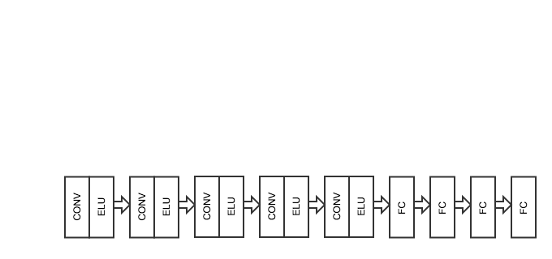
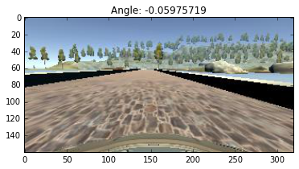
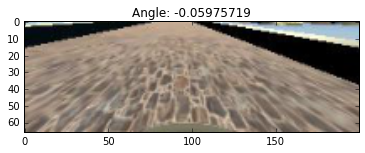
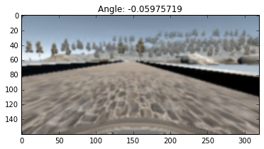
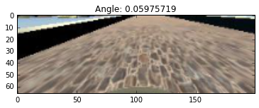

# Behaviour cloning


## Approach for Designing Model Architecture

1. Initially I set up drive.py to output a constant steering angle just to wire things up.
2. After that, I create a very simple neural network with a single convolutional layer and a single fully connected layer to set up the pipeline for `drive.py` to make predictions using a trained model. With this simple model, I could not get very far on the track - it was hardly a few seconds before the car steered off the track.
3. I then experimented with a few provided models like the [comma.ai model](https://github.com/commaai/research/blob/master/train_steering_model.py) and the model described in the [NVIDIA paper](http://images.nvidia.com/content/tegra/automotive/images/2016/solutions/pdf/end-to-end-dl-using-px.pdf) on end to end learning for self driving cars. However, none of these models worked out of the box. 
4. I started working on preprocessing a little more. I cropped the top 40% and the bottom 10% of the image and resized the resultant image to half it's size. This led to a little improvement and caused my model to get atleast as far as the first turn. 
5. However, to get past the first turn, I needed to add in data from both the left and right cameras. I did this by adding a small steering offset for images from the left camera and subtracting a small steering offset for images from the right camera. This got me past the first turn.
6. To get past the first bridge required a lot more data. To do this, I generated images inverted around the vertical axis for all the images from the center, left and right cameras and multiplied the corresponding steering angle by -1.
7. The next bottleneck was the sharp left turn after the bridge. To get past this, I needed to add significantly more data through several augmentation techniques like: adding noise to the image and blurring the image. This got me past this turn and with a little more training and choosing the right model over several epochs eventually got me past the track once.

## The Model

The model is very similar to the NVIDIA model with a few additional layers and dropout added to the fully connected layers for preventing overfitting:



- CONV: Convolutional Layer
- ELU: Exponential Linear Unit
- FC: Fully Connected Layer with ELU activation and dropout of 0.5

Details of the dimensions of each layer can be seen in the code snippet below:

```
model = Sequential()
model.add(Lambda(lambda x: x/127.5 - 1.,
            input_shape=input_shape,
            output_shape=input_shape))

model.add(Convolution2D(24, 5, 5, subsample=(2, 2), border_mode="valid", init="he_normal"))
model.add(ELU())

model.add(Convolution2D(36, 5, 5, subsample=(2, 2), border_mode="valid", init="he_normal"))
model.add(ELU())

model.add(Convolution2D(48, 5, 5, subsample=(2, 2), border_mode="valid", init="he_normal"))
model.add(ELU())

model.add(Convolution2D(64, 3, 3, subsample=(1, 1), border_mode="valid", init="he_normal"))
model.add(ELU())

model.add(Convolution2D(128, 3, 3, subsample=(1, 1), border_mode="valid", init="he_normal"))
model.add(ELU())

model.add(Flatten())

model.add(Dense(100, init="he_normal"))
model.add(ELU())
model.add(Dropout(0.5))

model.add(Dense(50, init="he_normal"))
model.add(ELU())
model.add(Dropout(0.5))

model.add(Dense(10, init="he_normal"))
model.add(ELU())
model.add(Dropout(0.5))

model.add(Dense(1, init="he_normal"))
```


## Model Training

- The data set was augmented using methods described below and this dataset was divided into training and validation data sets. A test data set was not used as the performance of the car on the track was used as the test evaluation.

- Since most of the data corresponds to steering angles of zero or very small angles, an important step was to filter out a considerable number of samples with very small steering angles so that the car learns to take sharp turns.

- Normalization of data was done within the network using a Lambda function in Keras.

- Several techniques were used to prevent overfitting like dropouts for fully connected layers, stride of 2 in upper convolutional layers and also L1 and L2 regularization.

- Initially starting with a learning rate of 0.001, I was unable to keep the car on the track. Lowering the learning rate significantly helped me and I decided to go with a learning rate of 0.`00001`.

- The model was trained using an Adam optimizer with a learning rate of `0.00001`. The training was done for 10 epochs and on each iteration, a checkpoint in keras was executed to save the model with the lowest validation error.


## Data Set Generation

The data set was developed with all the following images

1. Center camera images and their angles
2. Left camera images and their angles added to a small constant(0.16)
3. Right camera images and their angles added to a small constant(0.16)
4. Inverted images of 1, 2, 3 with their angles multiplied by -1
5. Blurred images of 1, 2, 3 with their angles unchanged
6. Noisy images of 1,2, 3 with their angles unchanged
7. Blurred versions of 4
8. Noisy versions of 4

### Examples:

#### Center image



#### Pre-processed Center image



#### Blurred Center image



#### Noisy Center image


#### Flipped Center image



## Video Footage

Example can be found [here](https://www.youtube.com/watch?v=XuTiITj86H4)


