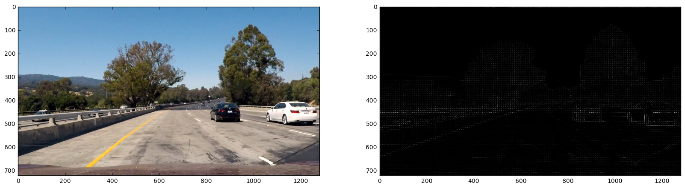
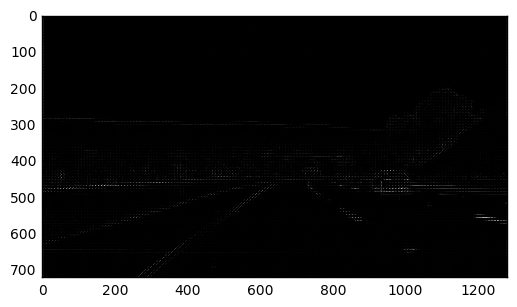
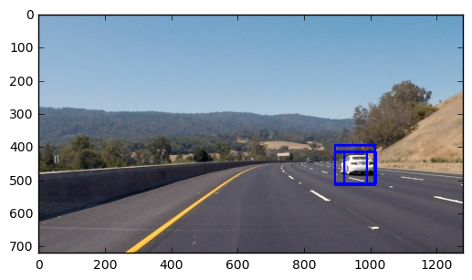
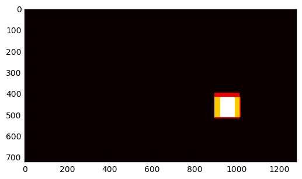
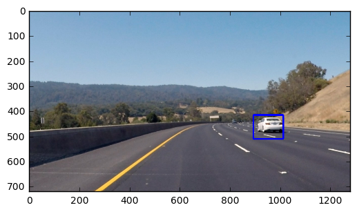

# Vehicle Detection

## Histogram of Oriented Gradients (HOG)

#### 1. Explain how (and identify where in your code) you extracted HOG features from the training images. Explain how you settled on your final choice of HOG parameters.


- The method `get_hog_features` in cell `In [2]` is used to extract HOG features from images.
- The `hog` function from `skimage.feature` is used for extracting the HOG features.
- The following were chosen as the final values of the HOG parameters:

	1. orientations: 8. This is the number of orientation bins. I have experimented with larger values of this parameter upto 35, but it doesn't improve the accuracy of the classifier much, so I settled with 8 which also allows the training and predictions to happen significantly faster.
	2. pixels\_per\_cell: 8. I experimented with this value to find this optimum value. This was mostly done by trial and error by looking at the corresponding HOG image output produced.
	3. cells\_per\_block: (2, 2) 
	4. transform_sqrt: True 
	5. feature_vector: True. Since I want the feature vector returned which will be useful for training, I always set this parameter to be true

- An example of HOG parameters chosen for an input image is show below:



- Apart from HOG features, spatial binning is performed to extract features. The function `bin_spatial` at cell `In [3]` is used to first resize the image to smaller dimensions using the openCV function `resize` and then return a single dimensional feature vector from this array using the `ravel` function. 

- Another method used to extract features is the color histogram technique. The method `color_hist` in cell `In [4]` is used to extract color histogram features from each channel of the image  using the `np.histogram` method and return it as a single feature vector using the `np.concatenate` method.


#### 2. Describe how (and identify where in your code) you trained a classifier using your selected HOG features (and color features if you used them).

- The `extract_features` method in cell `In [5]` is used to extract all features from a list of images including the HOG features, the spatially binned features and the histogram of colors features. 

- In cell `In [11]` features are extracted for both car and non-car images using the `extract_features` described above.

- In cell `In [12]` the features are scaled to zero mean and unit variance using the `sklearn.preprocessing.StandardScaler`.

- In cell `In [13]` the data of features and labels is split into the training set and the test set using the `train_test_split` function from `sklearn.preprocessing`.

- A Support Vector Classifier is created in cell `In [14]` using `sklearn.svm.SVC` and the `C` parameter is set to `1.0`. Also, the paramater `probability` is set to True so that the classifier outputs probabilities instead of labels which can be used to establish higher thresholds for car/non-car classification. 

- The SVC is fit using the training data by making use of the `fit` function.

```
# Use a linear SVC 
svc = SVC(C=1.0, probability=True)
# Check the training time for the SVC
t=time.time()
svc.fit(X_train, y_train)

```

## Sliding Window Search

#### 1. Describe how (and identify where in your code) you implemented a sliding window search. How did you decide what scales to search and how much to overlap windows?

- In the function `draw_bounding_boxes` in cell `In [18]`, a sliding window approach has been employed by using windows of different scales. The two scaled selected were `(96, 96)` and `(120, 120)`. These particular sizes were chosen as they allowed the detection of smaller as well as larger cars in the image but also did not adversely affect performance. Very small sizes like `(48, 48)` caused the processing to take far too long. The overlapping chosen was `0.7` as this value was able to get the car detection areas sufficiently hot in the heatmap and filter out false positives with a sufficient threshold.

- The function `add_heat` in cell `In [15]` is used to add values to a heatmap which is used for detecting vehicle boxes.

- The function `apply_threshold` in cell `In [16]` is used to apply a threshold to the above heatmap so that only regions which are sufficiently "hot" in the heatmap get detected as vehicles.

- The `label` function from `scipy.ndimage.measurements` is used to identify different regions in the heatmap.

- Finally, the `draw_labeled_bboxes` function in cell `In [17]` is used to draw bounding boxes for the detected regions.


#### 2. Show some examples of test images to demonstrate how your pipeline is working. How did you optimize the performance of your classifier?

##### Input Image
 


##### HOG Features




##### Sliding Window



##### HeatMap



##### Final Output


One of the methods used to obtain more reliable car detections was to use the probability output of the SVC rather than the actual label. This probability was then thresholded at a higher value of 0.6 rather than 0.5 to ensure that only windows with high probability of being a car were detected as cars. This reduces a large number of false positives.

## Video Implementation

#### 1. Provide a link to your final video output. Your pipeline should perform reasonably well on the entire project video (somewhat wobbly or unstable bounding boxes are ok as long as you are identifying the vehicles most of the time with minimal false positives.)

The video can be seen [here](https://www.youtube.com/watch?v=RF662E5KBVs).

#### 2. Describe how (and identify where in your code) you implemented some kind of filter for false positives and some method for combining overlapping bounding boxes.

- The most effective way of removing false positives was using the probability output of the SVC rather than the label output, which gives a much better control over how an image is determined to be a car.
- Also, the heatmap which shows how many overlapping boxes are present at any pixel is useful in reducing the number of false positives as well as to draw bounding boxes where multiple overlapping boxes occur. 
- The code related to the heatmap implementation can be see in cells `In []` and `In []`. In cell `In []`, the heat map is constructed by adding 1 to each pixel included in a bounding box. In cell `In []` a threshold is applied so that only pixels which have a very high probablity of being cars are detected as being so.


## Discussion

#### Briefly discuss any problems / issues you faced in your implementation of this project. Where will your pipeline likely fail? What could you do to make it more robust?

- The most difficult thing was figuring out a way to filter false positives. Although I have implemented a way of doing it, it is not perfect and needs improvement. In the future, I plan to add more advanced tracking from frame to frame to limit the number of false positives.
